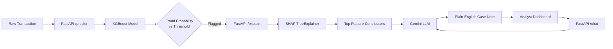

# 🛡️ Fraud Detection API + AI Analyst Copilot [URL - https://fraud-detection-copilot-by-llm.onrender.com/docs]

An end-to-end fraud detection system that goes beyond prediction — it explains *why* a transaction was flagged, in plain English, using SHAP-grounded LLM reasoning. Built to mirror how fraud detection actually works in production: a model narrows a million applications down to a review queue, and an AI copilot helps a human analyst act on it faster.


---

## 📌 Problem Statement

Fraud detection isn't just a classification problem — it's a **human-in-the-loop workflow problem**. Even a well-tuned model on a task this imbalanced will surface far more false positives than true fraud, because catching fraud reliably requires casting a wide net. The real bottleneck isn't the model's accuracy — it's the time an analyst spends figuring out *why* something got flagged.

This project builds both halves of that workflow:
1. A production-style fraud classifier trained on a realistic, imbalanced, time-evolving dataset
2. An LLM-powered copilot layer that turns raw model output (SHAP values) into a case note a human can read in seconds — and lets them ask follow-up questions grounded in the actual data, not hallucinated reasoning

---

## 🗂️ Dataset

**[Bank Account Fraud (BAF) Dataset Suite — NeurIPS 2022](https://www.kaggle.com/datasets/sgpjesus/bank-account-fraud-dataset-neurips-2022)**

- 1,000,000 bank account opening applications
- ~1.1% fraud rate (severe class imbalance)
- 32 features spanning applicant demographics, device/session behavior, application velocity, and credit risk indicators
- Spans 8 months (`month` column), enabling realistic time-aware evaluation

---

## 🏗️ Architecture



---

## 🔍 Key Findings from EDA

- **Time-aware fraud drift**: fraud rate is not static across the dataset's 8-month span — this directly motivated a **temporal train/test split** (train on months 0–5, test on 6–7) instead of a random split, to avoid inflating performance with future-leakage.
- **Missingness as a signal**: applicants missing previous-address history showed a **4.5x higher fraud rate** than those with a full history (1.42% vs 0.31%) — explicit `_was_missing` flags were engineered as features rather than silently imputing this away.
- **Established history reduces risk**: SHAP explanations consistently show that longer tenure at a previous/current address and bank account history *decrease* predicted fraud risk — a pattern that holds up as an intuitive, explainable signal rather than a black-box artifact.

---

## 🤖 Modeling Approach

| Step | Decision | Why |
|---|---|---|
| Split | Temporal (months 0–5 train, 6–7 test) | Mirrors real deployment — a model only ever has the past to predict the future |
| Missing values | Flagged (`_was_missing`), left as NaN otherwise | XGBoost handles NaN natively; missingness itself is predictive |
| Imbalance handling | Tested `scale_pos_weight` — **not used in final model** | It slightly *reduced* PR-AUC (0.180 vs 0.190 baseline); kept the version the metric actually supported |
| Metric | PR-AUC (not accuracy) | With 1.1% fraud, a "predict nothing" model scores ~99% accuracy while catching zero fraud |
| Tuning | RandomizedSearchCV, scored on `average_precision` | Faster than exhaustive grid search at this data scale |
| Threshold | Chosen at ≥80% recall, maximizing precision at that point | Deliberate, not the default 0.5 — appropriate for a severely imbalanced problem |

### Performance

| Metric | Baseline | Tuned (Final) |
|---|---|---|
| PR-AUC (temporal holdout) | 0.1899 | **0.1912** |
| Recall @ threshold | — | 80.1% |
| Precision @ threshold | — | 6.2% |
| Threshold | — | 0.0123 |

> PR-AUC of 0.19 is ~17x better than random guessing on this dataset (base rate ≈ 0.011). Low precision at high recall is expected and intentional in fraud detection — the model's role is to narrow the review queue, not make the final call. This is exactly the gap the AI Analyst Copilot is built to close.

---

## 🧠 The AI Analyst Copilot

Rather than handing an analyst a raw SHAP plot, the `/explain` endpoint:
1. Runs the transaction through the XGBoost model
2. Extracts the top 5 SHAP feature contributions
3. Passes those — and only those — to an LLM (Gemini) with an explicit instruction not to invent reasoning beyond the data
4. Returns a short, readable case note with a risk level and recommended action

The `/chat` endpoint lets an analyst ask grounded follow-up questions about that same transaction, using the SHAP context as the only source of truth.

**Resilience by design**: if the LLM provider is rate-limited or unavailable, the system falls back to a templated explanation built directly from the SHAP values — the workflow never breaks, it just degrades gracefully.

---

## 🔌 API Endpoints

| Endpoint | Method | Description |
|---|---|---|
| `/` | GET | Health check |
| `/predict` | POST | Returns fraud probability + flag decision |
| `/explain` | POST | Returns SHAP contributors + LLM-generated case note |
| `/chat` | POST | Answers analyst follow-up questions, grounded in the last explanation |

**Example — `/predict` request:**
```json
{
  "features": [0.7, 0.85, 24, 36, 35, 0.02, 15.5, 0, 1200, 3000, 4000, 5000, 5, 2, 1, 130, 0, 2, 1, 1, 20, 0, 1500, 0, 0, 8.5, 1, 1, 1, 0, 0, 0, 0, 0, 0]
}
```

**Example — `/predict` response:**
```json
{
  "prediction": 0,
  "fraud_probability": 0.0002,
  "threshold": 0.0123
}
```

Full interactive docs available at `/docs` (Swagger UI) once running.

---

## 🛠️ Tech Stack

- **Modeling**: Python, XGBoost, scikit-learn, SHAP
- **Backend**: FastAPI, Pydantic
- **LLM**: Google Gemini API
- **Deployment**: Render
- **Experimentation**: Google Colab (see `notebook/` for full EDA → modeling walkthrough)

---

## 📁 Project Structure

```
fraud-detection-copilot/
├── app.py                          # FastAPI application (predict/explain/chat)
├── requirements.txt
├── Models/
│   ├── fraud_model_final.joblib    # Trained XGBoost model
│   ├── shap_explainer.joblib       # Fitted SHAP TreeExplainer
│   └── model_metadata.json         # Threshold, feature list, tuning params
├── notebook/
│   └── fraud_detection_eda_modeling.ipynb   # Full EDA, preprocessing, training, tuning
└── README.md
```

---

## 🚀 Running Locally

```bash
git clone https://github.com/tarunmaurya13/fraud-detection-copilot.git
cd fraud-detection-copilot
python -m venv venv
venv\Scripts\activate        # Windows
pip install -r requirements.txt
```

Create a `.env` file:
```
GEMINI_API_KEY=your_key_here
```

Run:
```bash
uvicorn app:app --reload
```

Visit `http://127.0.0.1:8000/docs` to test all endpoints interactively.

---

## 📈 Future Improvements

- Real-time feature computation pipeline (currently assumes pre-computed features as input)
- Model monitoring for the fraud drift observed during EDA (retraining cadence)
- Persistent storage (PostgreSQL) for analyst decisions — approve/escalate/dismiss — to build a feedback loop dataset
- Groundedness evaluation: systematic sampling of case notes against SHAP values to quantify explanation accuracy
- Cost-per-case-note tracking for production-scale economics

---

## 👤 Author

**Tarun Maurya**
Final-year BCA (AI), Invertis University
[GitHub](https://github.com/tarunmaurya13) · tarunmaurya016@gmail.com
